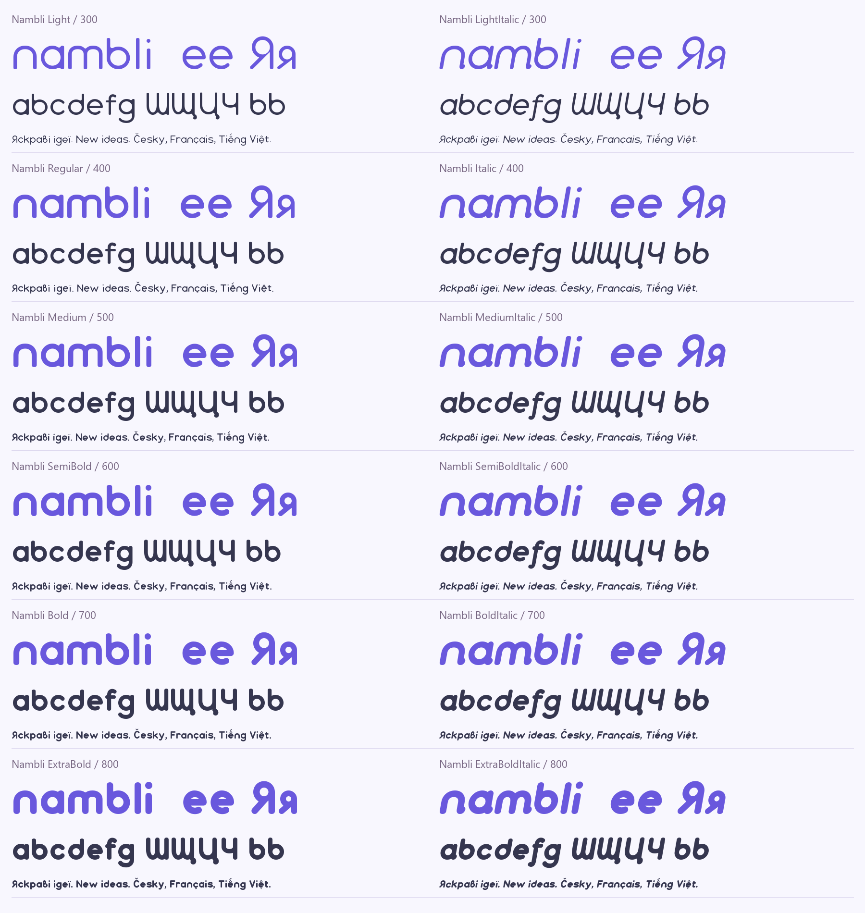

# Nambli

Nambli is a rounded display font family with Latin and Cyrillic coverage,
developed under the creative direction of **Yurii Tor**, with AI-assisted
outline programming and engineering.



Six weights — Light, Regular, Medium, SemiBold, Bold and ExtraBold — each have
an italic companion. The family is intended for branding, headings and short
text. Release **1.0.0** (font version 1.000) contains 970 encoded characters
and 998 glyphs per style. Yurii Tor approved the final designs for publication
on 2026-10-07. The earlier v0.7.4 release remains available separately.

## Visual review candidate — 1.003

This branch's editable UFOs contain the **1.003 candidate for Google Fonts design review**.
Download the [1.003 review package](fonts/candidates/1.003/Nambli-1.003-review.zip)
(twelve TTFs, twelve WOFF2 files, OFL and SHA-256 checksums), or inspect the
[individual TTFs](fonts/candidates/1.003/ttf). The editable sources are in
[`sources/ufos`](sources/ufos); build and validation evidence is in
[`documentation/visual-quality-1.003`](documentation/visual-quality-1.003).
It retains the accepted contour smoothing and distinct missing-glyph symbol,
removes the added overshoot rejected by the owner, and modestly strengthens
only the side carons in Ľ, ľ, ď, ť and their shared mark. Other accent designs,
including the Turkish alphabet's accents, are retained.
See the [visual review record](documentation/VISUAL-QUALITY-1.003.txt) and
[before/after review](documentation/review/visual-quality-1.003/Nambli-Design-Review.html)
for all twelve faces, with changed glyphs and retained diacritics shown separately.
The 1.002 experiment and its editable-source ZIP remain in `fonts/candidates/1.002`.
The public release and website have not been updated with this candidate.

## Previously approved candidate — 1.001

The owner approved the eight contour changes on 2026-10-08. Those editable
sources are preserved at commit `0d5deb9`; the version **1.001** TTFs and WOFF2 files are
isolated in `fonts/candidates/1.001/ttf` and `fonts/candidates/1.001/webfonts`.
The existing `fonts/ttf`, `fonts/webfonts` and supplementary `fonts/otf`
retain released version 1.000. No 1.001 OTF build or public release is claimed.

The owner also reports submitting the Google Fonts designer profile form.
Catalog publication is pending. See the [adoption record](documentation/google-fonts-qa/2026-10-08/adoption-1.001/REPORT.md)
for build, package QA and remaining upstream work.

## Download and use

Download the ZIP from [Releases](https://github.com/Tor-Production/nambli-font/releases).
Install TTF or OTF files, not both formats simultaneously. WOFF2 is provided
for self-hosted websites. Font files are in `fonts/ttf`, `fonts/otf` and
`fonts/webfonts`.

## License and attribution

The font software and original project sources are offered under the
[SIL Open Font License 1.1](OFL.txt), without a Reserved Font Name.
Commercial design use, embedding, modification and redistribution are allowed
under the license. The font may not be sold by itself; bundling with other
software is permitted. This does not license unrelated Nambli branding assets.
Yurii Tor is listed in [AUTHORS.txt](AUTHORS.txt).

See [provenance](documentation/PROVENANCE.txt) for the role of AI tools and
the human contribution. No government registration or judicial determination
of authorship is claimed by this repository.

## Source and build

The twelve editable UFO3 masters in `sources/ufos` include the complete current candidate
outlines, metrics, Unicode mapping, kerning and OpenType feature source. Build
them with the pinned Fontmake toolchain:

Install Python and the packages in `requirements.txt`, then run:

```sh
python -m pip install -r requirements.txt
python sources/build_fontmake.py
```

The build writes TTF and WOFF2 files into `build-fonts/`, validates them against
their editable sources, and leaves committed font files untouched. See
[building and validation instructions](sources/BUILDING.md) for the repeat-build
check and the distinction between the current production pipeline and historical
construction scripts. The latter remain in `sources/`, with the historical
master in `sources/master`.

## Google Fonts status

**Not yet included in Google Fonts.** The family was submitted in
[google/fonts#11082](https://github.com/google/fonts/issues/11082). Yurii Tor's
Individual CLA was verified on 2026-10-07. Submission and a signed CLA do not
establish curatorial acceptance.

Release 1.0.0 adds required characters and language support, corrects
layout and outline defects, and supplies a reproducible production build.
The final designs are author-approved. Detailed results and remaining
findings are recorded in [Google Fonts status](documentation/GOOGLE-FONTS-STATUS.txt).

The latest [design refinement proof](documentation/refinement/Nambli-Refinement-Review.html)
compares the previous candidate with the centered `@`, smoother hooks, circular
crossed-tail loops and reused rounded ƹ. It contains all twelve styles and is
self-contained. The [complete technical proof](documentation/review/Nambli-Technical-Review.html)
also includes the full set of additions against v0.7.4.
